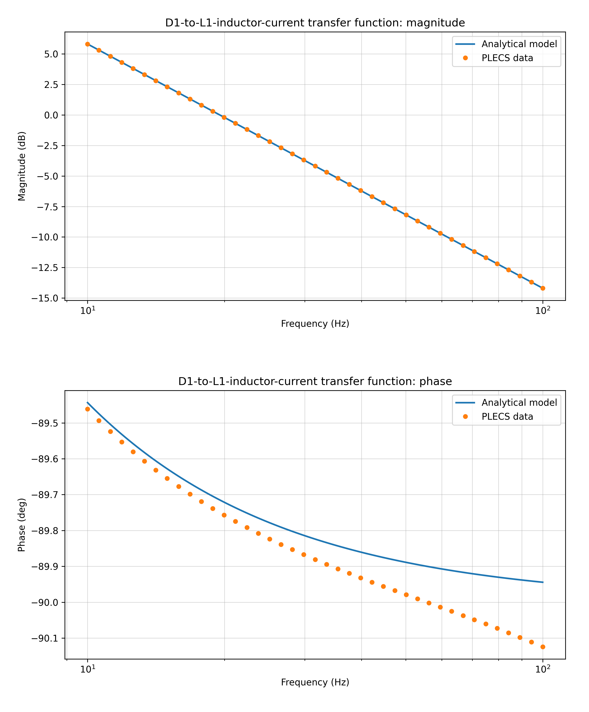
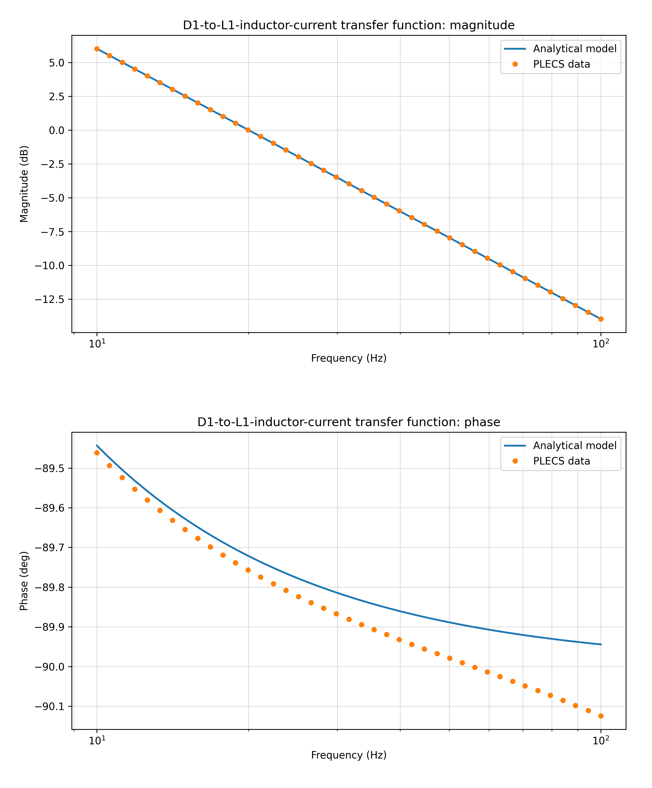
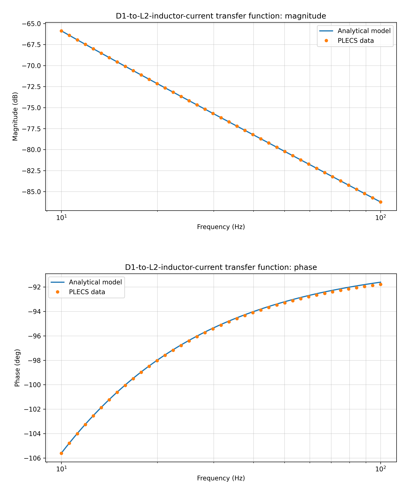
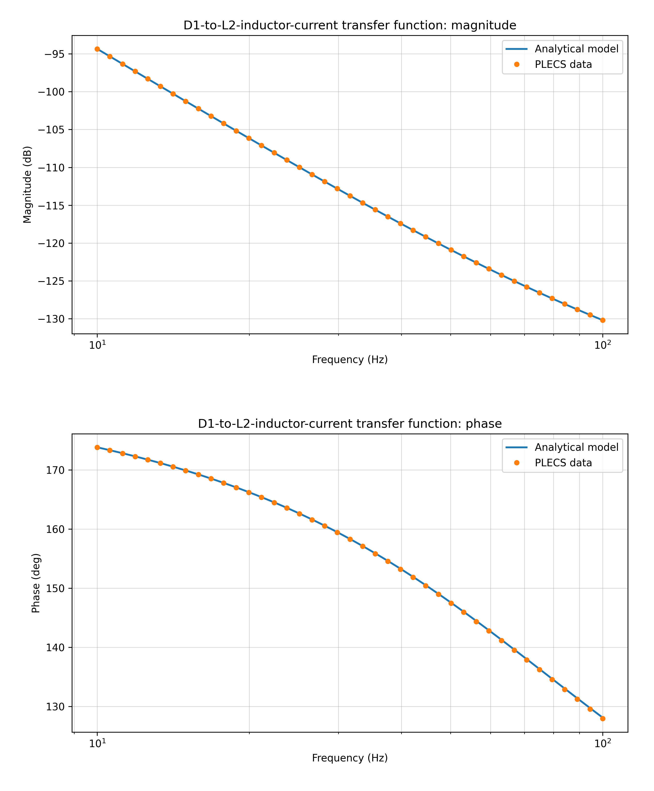
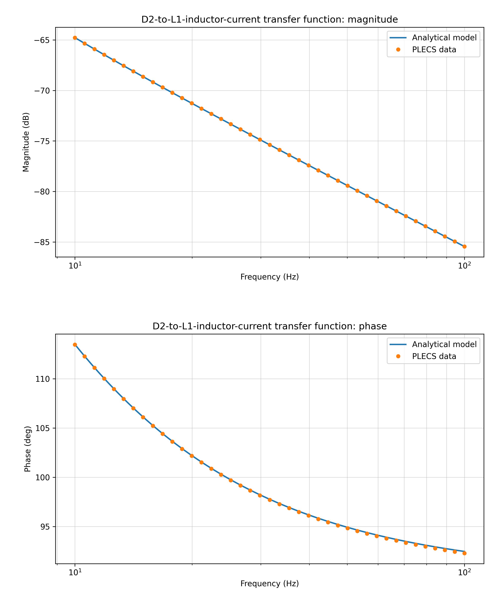
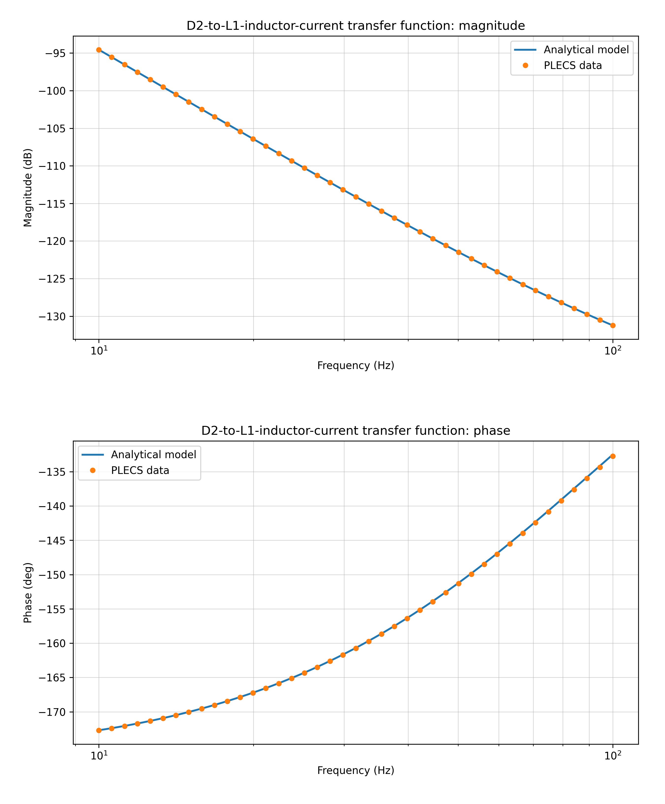
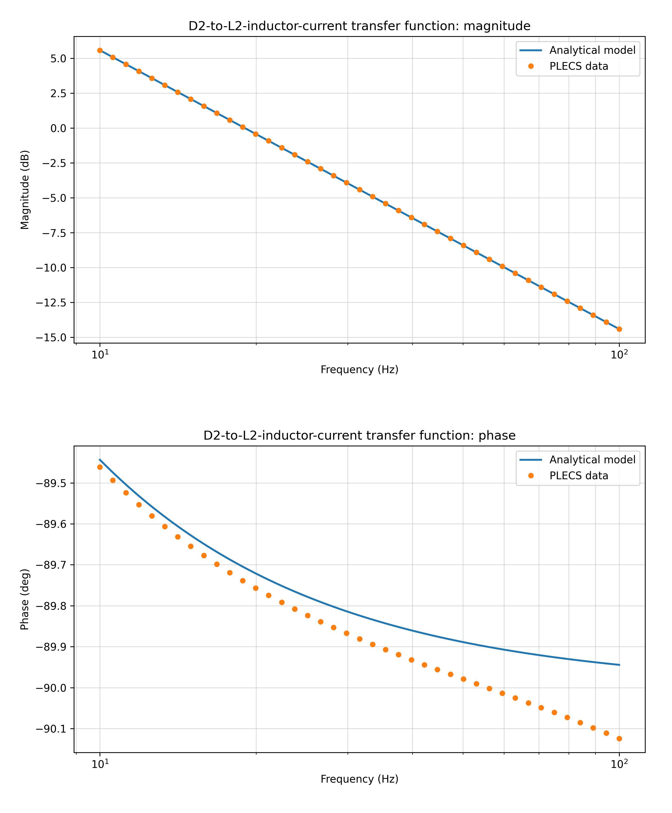
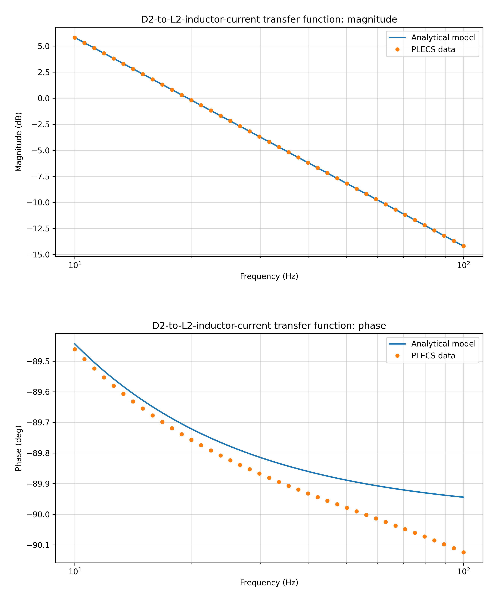

# Switch-Inductor Small-Signal Modeling and PLECS Validation

This project develops and validates analytical small-signal models for a
switched-inductor power system. The engineering workflow connects the original
switching circuit and digital control logic to handwritten derivations,
case-specific transfer functions, and PLECS AC-sweep verification.

## Why this project matters

The system is piecewise: its averaged equations depend on whether `D1 > D2` or
`D2 > D1`. Four duty-cycle-to-inductor-current channels must therefore be
checked in two operating regions, producing eight validation cases.

```text
Switching circuit and digital control
                  |
                  v
        Large-signal equations
                  |
                  v
          Averaged model by region
                  |
                  v
        Linearized state-space model
                  |
                  v
      Small-signal transfer functions
                  |
                  v
     Analytical Bode response vs. PLECS
```

## Validation matrix

| Input | Output | Region | Samples | Maximum magnitude error | Maximum phase error |
|---|---|---|---:|---:|---:|
| D1 | IL1 | D1 > D2 | 41 | 0.000006 dB | 0.180000 deg |
| D1 | IL1 | D2 > D1 | 41 | 0.000007 dB | 0.180000 deg |
| D1 | IL2 | D1 > D2 | 41 | 0.000005 dB | 0.180193 deg |
| D1 | IL2 | D2 > D1 | 41 | 0.000903 dB | 0.172198 deg |
| D2 | IL1 | D1 > D2 | 41 | 0.000007 dB | 0.179884 deg |
| D2 | IL1 | D2 > D1 | 41 | 0.039275 dB | 0.081207 deg |
| D2 | IL2 | D1 > D2 | 41 | 0.000007 dB | 0.180000 deg |
| D2 | IL2 | D2 > D1 | 41 | 0.000006 dB | 0.180000 deg |

All cases use 41 logarithmically spaced samples from 10 Hz to 100 Hz. The
complete machine-readable summary is available in
[`results/validation_summary.csv`](results/validation_summary.csv).

### Original analytical-model versus PLECS comparisons

The following figures are direct, unedited copies of the comparison plots from
the original validation folders. Each figure contains magnitude and phase.

<table>
  <tr>
    <td align="center"><strong>D1 → IL1, D1 &gt; D2</strong><br></td>
    <td align="center"><strong>D1 → IL1, D2 &gt; D1</strong><br></td>
  </tr>
  <tr>
    <td align="center"><strong>D1 → IL2, D1 &gt; D2</strong><br></td>
    <td align="center"><strong>D1 → IL2, D2 &gt; D1</strong><br></td>
  </tr>
  <tr>
    <td align="center"><strong>D2 → IL1, D1 &gt; D2</strong><br></td>
    <td align="center"><strong>D2 → IL1, D2 &gt; D1</strong><br></td>
  </tr>
  <tr>
    <td align="center"><strong>D2 → IL2, D1 &gt; D2</strong><br></td>
    <td align="center"><strong>D2 → IL2, D2 &gt; D1</strong><br></td>
  </tr>
</table>

The independently regenerated figures from the current equation source are in
[`results/figures/`](results/figures/). The provenance note for the updated
`D2 → IL1, D2 > D1` equation is recorded in
[`docs/validation_report.md`](docs/validation_report.md).

## Repository contents

- [`docs/derivations/`](docs/derivations/) contains the evolving handwritten
  large-signal, averaged, state-space, and transfer-function derivations.
- [`src/switch_inductor/equations/`](src/switch_inductor/equations/) keeps each
  case-specific analytical expression explicit for equation-by-equation audit.
- [`models/plecs/`](models/plecs/) contains the eight PLECS 5.0 AC-sweep cases.
- [`models/simulink/`](models/simulink/) contains the original switching system
  and digital control implementation.
- [`data/raw/plecs/`](data/raw/plecs/) contains the source frequency-response
  exports used by the Python validation pipeline.
- [`results/`](results/) contains reproducible tables, summary metrics, and
  portfolio-ready comparison figures.

See [`docs/methodology.md`](docs/methodology.md) for the modeling workflow and
[`docs/derivation_status.md`](docs/derivation_status.md) for the honest status
of the evolving handwritten derivations.

## Reproduce the validation

Python 3.11 or later is required.

```bash
python -m venv .venv
# Windows: .venv\Scripts\activate
# Linux/macOS: source .venv/bin/activate
python -m pip install -r requirements.txt
python scripts/run_validation.py
```

Generated files are written to `results/generated/`, which is intentionally
ignored by Git. To run one case:

```bash
python scripts/run_validation.py --case d2_to_il1__d2_gt_d1
```

Run the repository tests with:

```bash
python -m unittest discover -s tests -t . -v
```

The tests verify that all eight model/data pairs exist, that the stored tables
are reproducible from the current equations, and that the validation errors
stay within the documented bounds.

## Software models

- PLECS model format: PLECS 5.0
- Simulink requirement: MATLAB/Simulink R2025b or later
- The Simulink model references Simscape, Simscape Electrical, control, and
  battery-related library blocks. Exact product requirements should be checked
  on the target MATLAB installation.

## Current scope and limitations

- The numerical validation pipeline is complete for all eight cases.
- The handwritten derivation set is still being expanded. The PDFs are source
  engineering notes, not yet a complete typeset derivation for every channel.
- The current `D2 -> IL1, D2 > D1` equation module was saved after the earliest
  comparison table. This repository regenerates that case from the current
  equation source and records the provenance in
  [`docs/validation_report.md`](docs/validation_report.md).
- The `D2 -> IL1, D1 > D2` case deliberately uses a different
  battery-resistance set (`0.01 ohm` instead of `0.0065 ohm`). This is a
  parameter-variation test: close PLECS/analytical agreement demonstrates that
  the derived transfer function is not tied to a single resistance value.

## Publishing note

Copyright © 2026 王静远. All rights reserved. This repository is intentionally
published without an open-source license; public visibility does not grant
permission to reuse, modify, redistribute, or commercially exploit its
contents. Publication rights should still be confirmed against any university,
laboratory, sponsor, or employer obligations. See
[`docs/licensing.md`](docs/licensing.md) for the recorded decision and scope.
